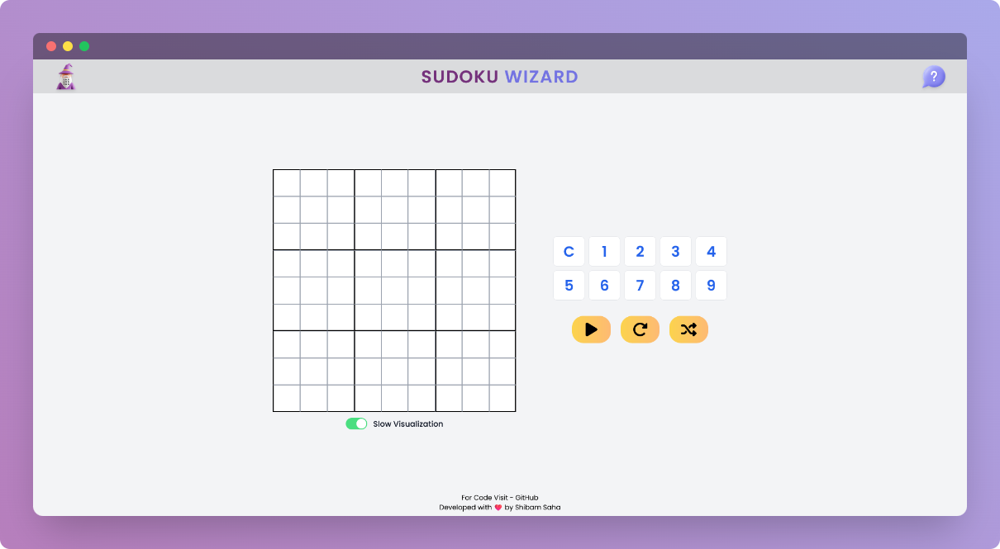
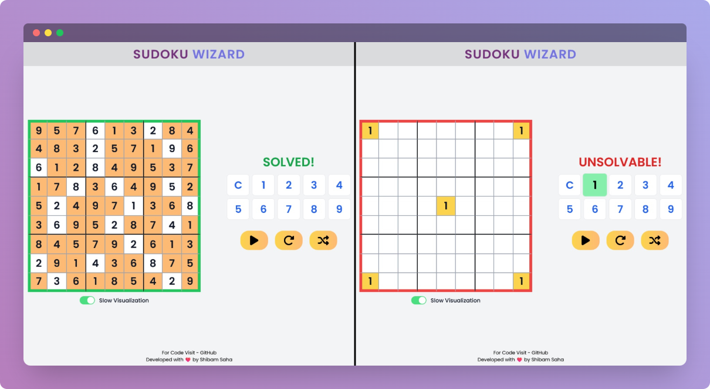

    

    <h1>Sudoku Wizard</h1>
    
Sudoku Generator and Solver

    
    
    

 

## ⚡ Introduction

Sudoku Wizard is an algorithmic project based on Backtracking Algorithm. This project illustrates the operation of the backtracking algorithm, which is used to solve any sudoku puzzle.

## ✨ Features
  
-  Generate sudoku problem
-  Solve existing sudoku problem
-  Visualize how the backtracking algorithm works in behind

## ⚙️ Tech Stack
  
- HTML
- Tailwind CSS
- JavaScript
- Vite JS

## 🎯 Goals

- [x] To create a game centric project
- [x] To apply `Backtracking Algorithm` in a real life scenario

## 🖼️ Screenshots

## 👋🏻 Contact

