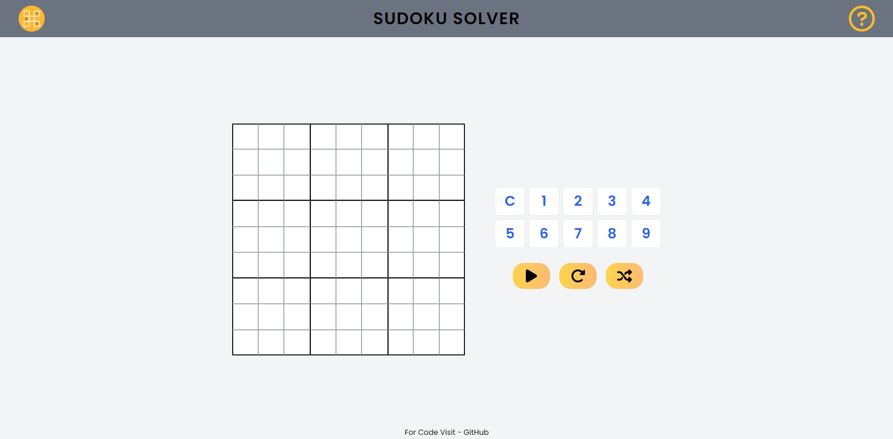
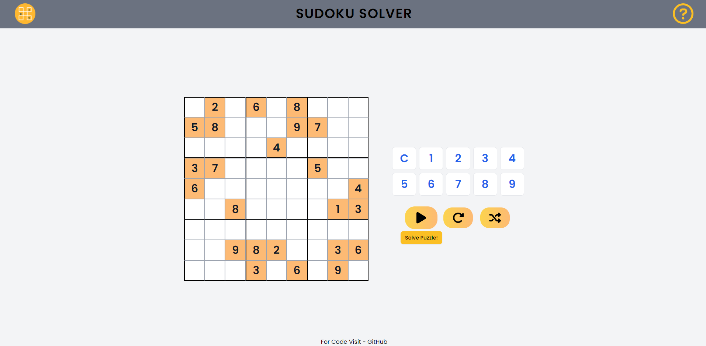

## Sudoku Solver

**What is Sudoku game?**

`Sudoku` is a logic-based, combinatorial number-placement puzzle. In classic Sudoku, the objective is to fill a `9 × 9` grid with digits so that each column, each row, and each of the nine `3 × 3` sub-grids that compose the grid contain all of the digits from 1 to 9.

**Details**

Sudoku Solver is an algorithmic project based on `Backtracking Algorithm`. This projects shows a visual representation of the working of backtracking algorithm which is used to solve a Sudoku Puzzle.

**Tech Stack**

- HTML, Tailwind CSS, Vanilla Javascript, ViteJS

**Live Link**

- [Sudoku Solver](https://s4shibam-sudoku-solver.netlify.app)

**Reference Images / Screenshots**

- Landing Page

- Preset Sudoku Puzzle

- Sudoku Puzzle During Solving

- Mobile View

